# AWS S3 Laboratory Work 4

## Task Description

### Objective  
The goal of this lab is to get familiar with **Amazon S3 (Simple Storage Service)** and practice performing basic operations such as:

- Creating **public** and **private** buckets  
- Uploading and organizing objects  
- Working with S3 using the **AWS CLI** (copying, moving, synchronizing files)  
- Configuring **versioning** and **encryption**  
- Using **S3 Static Website Hosting**  
- Applying **Lifecycle rules** for archiving old data  

---

## Task Conditions

**Amazon S3** is an AWS object storage service designed for storing any type of files — images, backups, documents, logs, etc. Each object is stored inside a **bucket** and has a unique **key**. The "directories" you see in the console are actually **prefixes** of keys, not real directories.

In this lab, I will create two buckets:

- **Public bucket** – for storing user avatars and static content  
- **Private bucket** – for logs and service files (with a Lifecycle policy)  

---

## Step 1: Preparation

**Region:** `eu-central-1 (Frankfurt)`  

**Bucket naming convention:**

- Public bucket: `cc-lab4-pub-k06`  
- Private bucket: `cc-lab4-priv-k06`  

---

## Local Directory Structure

On my local computer, I will create the following folder and file structure:

        s3-lab/
        ├── public/
        │   ├── avatars/
        │   │   ├── user1.jpg
        │   │   └── user2.jpg
        │   └── content/
        │       └── logo.png
        ├── private/
        │   └── logs/
        │       └── activity.csv
        └── README.md

---

## Step 2: Creating Buckets

I will create buckets **using object ownership: enforced** — modern and secure approach.

### Step 1: Creating Buckets Without ACL

**Public Bucket:**

1. Going to **AWS Console → S3 → Create bucket**.  

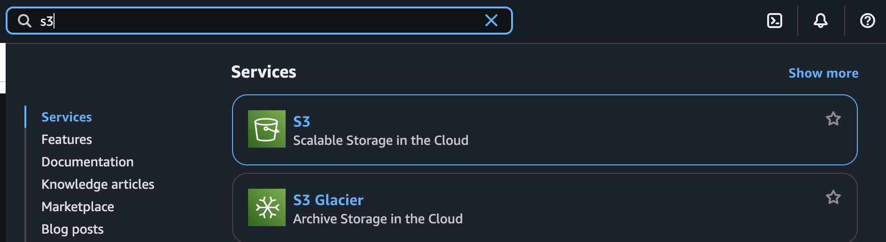

2. Setting the following parameters:  
   - **Name:** `cc-lab4-pub-k06`  
   - **Region:** `eu-central-1`  
   - **Object Ownership:** `Bucket owner enforced (ACLs disabled)`  
   - **Block all public access:** leave **enabled** for now  
3. Clicking **Create bucket**  

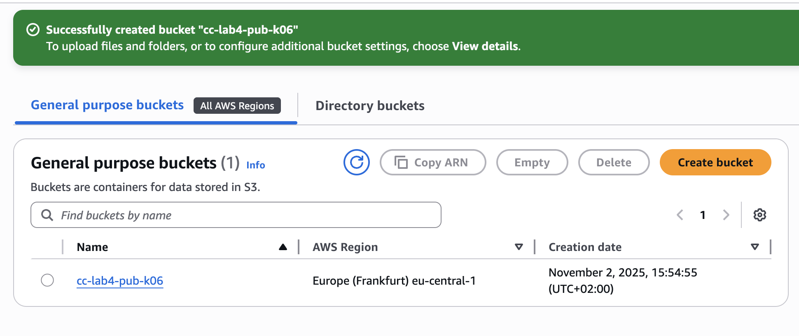

**Private Bucket:**

- Repeating the steps for the second bucket, with the name: `cc-lab4-priv-k06`.

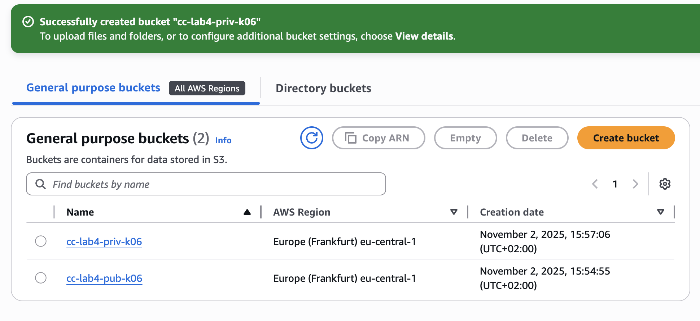

> After creation, I have:  
> - Public bucket: `cc-lab4-pub-k06`  
> - Private bucket: `cc-lab4-priv-k06`  

> In this mode, all objects belong to the bucket owner and **ACLs are completely ignored**. Access is managed via **IAM and Bucket Policies**.

---

### Step 2: Creating an IAM User and Assigning Permissions

In this step, I create a dedicated AWS user (`s3-uploader`) with **minimal permissions** to work with our buckets. This demonstrates the AWS principle of **least privilege**.

#### Step 2.1: Creating the User

1. Going to **IAM → Users → Create user**.  
2. Creating a user named `s3-uploader`.  

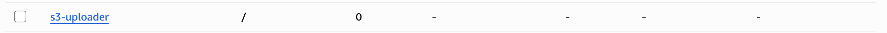

3. Doing **not** enable console access — this user will operate only via **API (CLI/SDK)**.  
4. In the user page → **Security credentials → Create access key**.  
   - Access type: **Command Line Interface (CLI)**  

   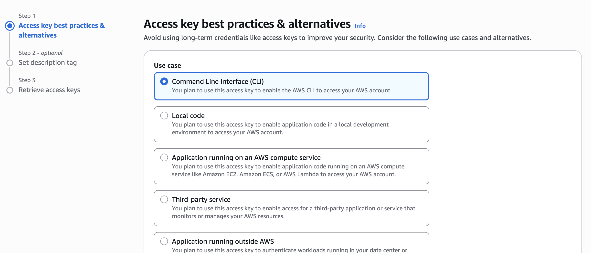

   - Copy the **Access key ID** and **Secret access key** (needed for CLI).  


---

#### Step 2.2: Creating an IAM Policy (Minimal Permissions)

A policy is a JSON document defining allowed or denied actions. Goal: give `s3-uploader` **read/write** to the public bucket and **limited access** to logs in the private bucket.

1. Going to **IAM → Policies → Create policy → JSON**  
2. Pasting the following JSON:

```json
{
  "Version": "2012-10-17",
  "Statement": [
    {
      "Sid": "ListOnlyTheseBuckets",
      "Effect": "Allow",
      "Action": ["s3:ListBucket"],
      "Resource": [
        "arn:aws:s3:::cc-lab4-pub-k06",
        "arn:aws:s3:::cc-lab4-priv-k06"
      ]
    },
    {
      "Sid": "ReadWritePublicBucketLimited",
      "Effect": "Allow",
      "Action": ["s3:GetObject", "s3:PutObject", "s3:DeleteObject"],
      "Resource": "arn:aws:s3:::cc-lab4-pub-k06/*"
    },
    {
      "Sid": "LogsRWButOnlyUnderLogsPrefix",
      "Effect": "Allow",
      "Action": ["s3:GetObject", "s3:PutObject", "s3:DeleteObject"],
      "Resource": "arn:aws:s3:::cc-lab4-priv-k06/logs/*"
    }
  ]
}
```

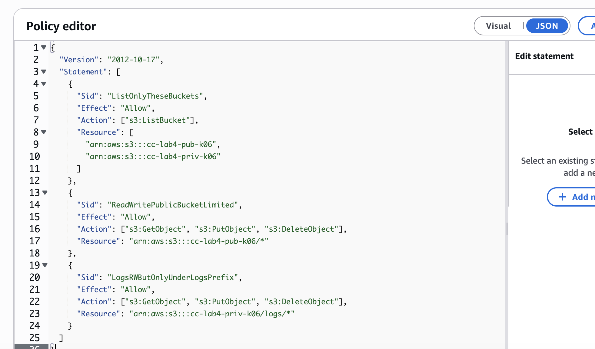

### Policy Explanation

| Section                    | Purpose                                     | Notes                                         |
|----------------------------|---------------------------------------------|-----------------------------------------------|
|ListOnlyTheseBuckets        | Allows `ListBucket` on two buckets          |Without it, the user cannot see bucket contents|
|ReadWritePublicBucketLimited| Full access to public bucket                | User can upload, read, delete objects         |
|LogsRWButOnlyUnderLogsPrefix| Access limited to `logs/` in private bucket | Demonstrates least privilege principle        |

---

### Step 2.3: Attach Policy to User

1. Going to **IAM → Users → s3-uploader → Permissions → Add permissions**  
2. Selecting **Attach policies directly**  
3. Finding and selecting `S3UploaderPolicy`  

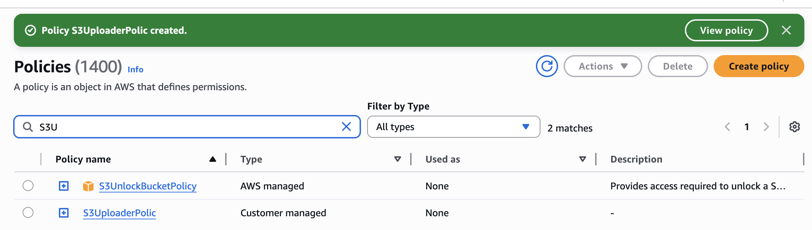

4. Clicking **Next: Review → Add permissions**  

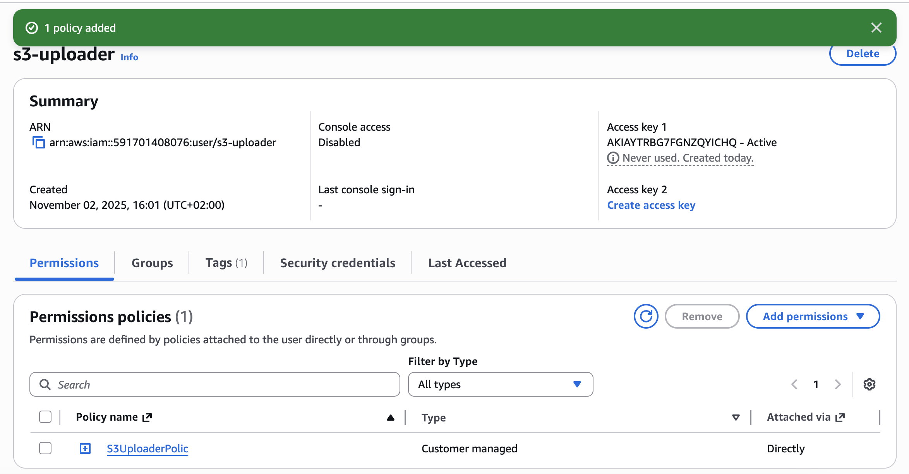

---

### Step 3: Allow Public Read Access to the Public Bucket

To make files in the public bucket accessible to everyone (e.g., avatars on a website):

1. Disabling the bucket protection: **Permissions → Block public access → uncheck “Block all public access” → Save**  

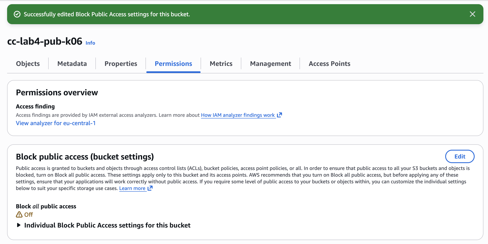

2. Opening **Bucket Policy → Edit** and inserting:

```json
{
  "Version": "2012-10-17",
  "Statement": [
    {
      "Sid": "AllowPublicRead",
      "Effect": "Allow",
      "Principal": "*",
      "Action": "s3:GetObject",
      "Resource": [
        "arn:aws:s3:::cc-lab4-pub-kXX/avatars/*",
        "arn:aws:s3:::cc-lab4-pub-kXX/content/*"
      ]
    }
  ]
}
```

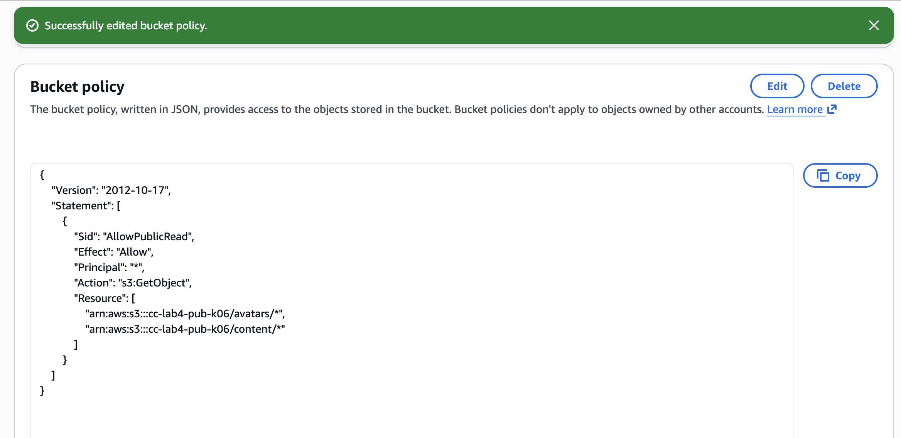

### Notes

- **Principal: "*"** — any Internet user can read the objects (cannot modify).  
- **Action: s3:GetObject** — read-only permission.  
- **Resource** — specifies prefixes (`avatars/` and `content/`) available for reading.  

> Files inside `avatars/` and `content/` are now publicly accessible via URL.

### What Does “Block All Public Access” Mean?

The **“Block all public access”** option in Amazon S3 is a security setting that **prevents any object or bucket from being publicly accessible**.  

---

## Step 3: Uploading Objects via AWS Management Console

1. Going to the bucket `cc-lab4-pub-k06`.  
2. Navigating to the `avatars/` directory and click **Upload**.  
3. Uploading the file `user1.jpg` from my local folder `s3-lab/public/avatars/`.  
4. In the **Permissions** section, selecting **Grant public-read access**.  
5. Completing the upload by clicking **Upload**.

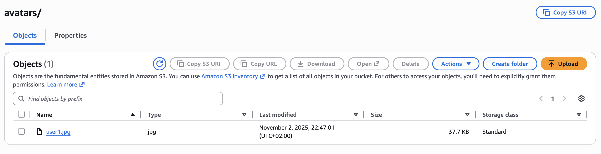

---

### Difference Between Object Key and File Name

- **File Name:** The name of the file on your local computer (e.g., `user1.jpg`).  
- **Object Key:** The unique identifier of the object within the S3 bucket, which includes the **full path (prefix) plus the file name** (e.g., `avatars/user1.jpg`).  

> In S3, the concept of “folders” is logical — the **object key** defines the location and name, not a real directory.

---

## Step 4: Uploading Objects via AWS CLI

1. Installing and configure **AWS CLI** if not done previously.  
2. Uploading `user2.jpg` to the public bucket:

```bash
aws s3 cp s3-lab/public/avatars/user2.jpg s3://cc-lab4-pub-k06/avatars/user2.jpg --acl public-read
```

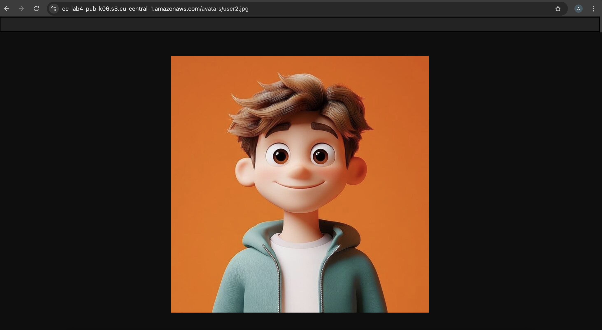

3. Upload `logo.png` to the public bucket under the `content/` directory, also making it public:

```bash
aws s3 cp s3-lab/public/content/logo.png s3://cc-lab4-pub-k06/content/logo.png --acl public-read
```

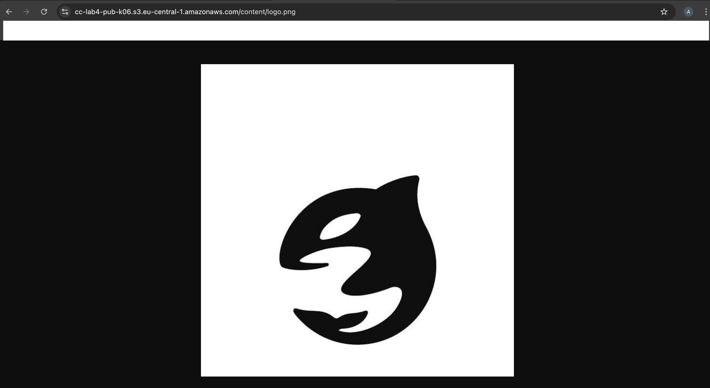


4. Upload `activity.csv` to the private bucket without public access:

```bash
aws s3 cp s3-lab/private/logs/activity.csv s3://cc-lab4-priv-kXX/logs/activity.csv
```

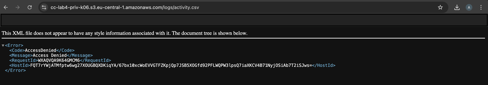

---

### Difference Between `aws s3 cp`, `mv`, and `sync`

- **`cp`** — copies files from local to S3 (or S3 to local) **without deleting** the source.  
- **`mv`** — moves files from source to destination **and deletes** the original after successful transfer.  
- **`sync`** — synchronizes the contents of a local folder and a bucket (or between buckets), copying only **new or changed files**.

---

### Purpose of `--acl public-read`

The flag `--acl public-read` sets the uploaded object to be **publicly readable**.  
Without this flag, objects inherit the bucket’s default permissions (**private by default**).  
This is useful for making assets like avatars or website content accessible to all users on the Internet.

---

## Step 5: Verifying Access to Objects

1. Opening the URL of the uploaded **public object** in your browser:

[View public object: user1.jpg](https://cc-lab4-pub-k06.s3.eu-central-1.amazonaws.com/avatars/user1.jpg)

- You should see the image displayed.

2. Try opening the URL of the uploaded **private object** (`activity.csv` in the private bucket).  

[View private object: activity.csv](https://cc-lab4-priv-k06.s3.eu-central-1.amazonaws.com/logs/activity.csv)

- The file should **not be accessible** publicly, confirming that private access is enforced.

---

## Step 6: Object Versioning

1. Enabling **versioning** for both buckets:  
   - Going to **Properties → Bucket Versioning → Enable**  

   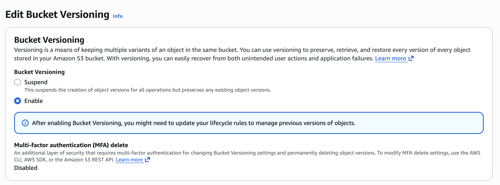

2. Modify the file `logo.png` locally and upload it again to the bucket.  
   - A **new version** of the object will be created automatically.  

3. Check the **Versions** tab in the S3 console to see all versions of the object.

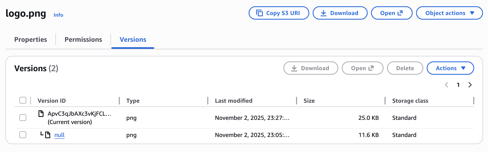

[View updated public object: logo.png](https://cc-lab4-pub-k06.s3.eu-central-1.amazonaws.com/content/logo.png)

---

### What Happens if Versioning is Disabled After Being Enabled?

- Disabling versioning does **not delete existing versions** — all previously created versions are retained.  
- New uploads will **overwrite objects without creating new versions**, effectively stopping version tracking for future changes.  
- Existing object versions can still be accessed or restored if needed.

---

## Step 7: Creating Lifecycle Rules for the Private Bucket

1. In the **private bucket**, going to **Management → Lifecycle rules → Create rule**.  
2. Setting the following parameters:  
   - **Rule name:** `logs-archive`  
   - **Prefix:** `logs/`  

3. Configure actions:  
   - **Transition:** mov to **Standard-IA** after 30 days  
   - **Transition:** move to **Glacier Deep Archive** after 365 days  
   - **Expiration:** delete objects after 1825 days (5 years)  

4. Save the rule by clicking **Create rule**.

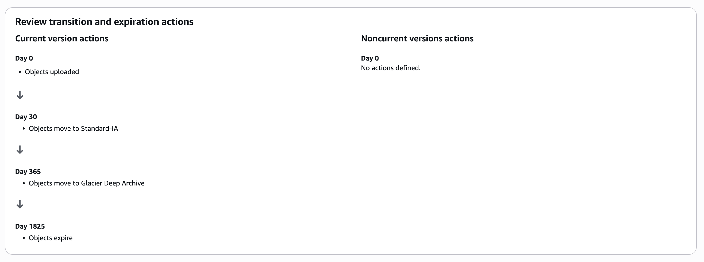

---

### What is Storage Class in Amazon S3 and Why Is It Needed?

- **Storage Class** defines the **cost, availability, and durability** of objects in S3.  
- Common storage classes:  
  - **Standard** — frequent access, high durability  
  - **Standard-IA** (Infrequent Access) — lower cost, for less frequently accessed data  
  - **Glacier / Glacier Deep Archive** — very low cost, long-term archival, slower retrieval  

> Using lifecycle rules automates log management: old files are automatically archived or deleted, optimizing costs and storage efficiency.

---

## Step 8: Hosting a Static Website on Amazon S3

1. **Creating a new bucket** for hosting my static website:  
   - **Name:** `cc-lab4-web-k06`  
   - **Region:** `eu-central-1`  
   - **Object Ownership:** ACLs enabled (Can be configured using ACLs)  
   - **Block all public access:** uncheck (allow public access)  
   - Click **Create bucket**

   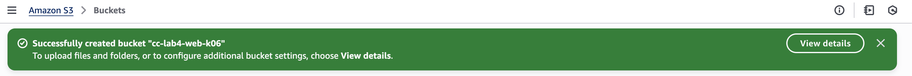

2. **Enable static website hosting**:  
   - Going to **Properties → Static website hosting → Edit → Enable**  
   - Choosing **Host a static website**  
   - Setting:
     - **Index document:** `index.html`

     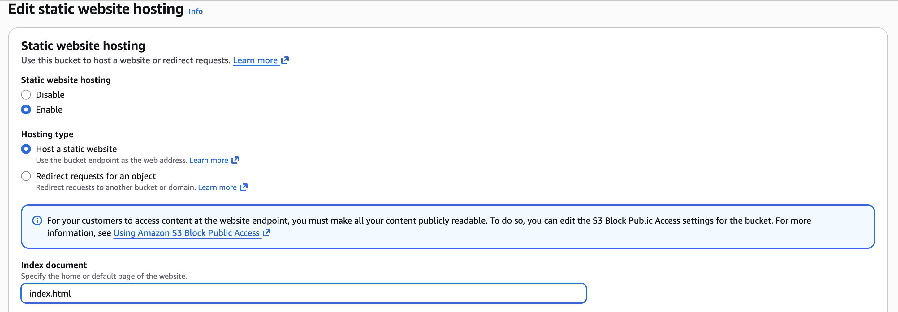

3. **Upload website files**  
   - Coping all files from your website folder into the bucket `cc-lab4-web-k06`  
   - Making sure to **grant public-read access** to all files (so they are viewable online)

4. **Open your static website**  
   - Using the **URL** displayed in the *Static website hosting* settings:  

[Static Website URL — cc-lab4-web-k06](https://cc-lab4-web-k06.s3.eu-central-1.amazonaws.com/index.html)

---

### Why Use S3 for Static Website Hosting

Amazon S3 allows you to **host static websites** (HTML, CSS, JS, images) without running any servers.  
For example, a **React app’s build files** can be uploaded directly to an S3 bucket for fast, reliable hosting.

While this method is simple and cost-effective, **for production use** it’s better to host with services like **AWS Amplify**, which provide extra features such as:
- HTTPS by default  
- Continuous deployment from Git  
- Custom domain management  
- Advanced caching and scaling

---

## Conclusion

During this lab work, the main features of Amazon S3 were explored and applied in practice:

- Creation and configuration of **public and private buckets**.  
- Use of **ACL** and **Object Ownership (Bucket owner enforced)** for access management.  
- Configuration of **IAM users and policies**.  
- Uploading and managing objects via both **AWS Management Console** and **AWS CLI**.  
- Verification of access to public and private objects.  
- Enabling **versioning** and analyzing its behavior when disabled.  
- Setting up **Lifecycle rules** for automatic data archiving and deletion.  
- Deploying a **static website** using S3.

As a result, practical experience was gained in using Amazon S3 as a versatile service for data storage, access control, and static content hosting.

---

## Useful Links

- [Amazon S3 — Official AWS Page](https://aws.amazon.com/s3/)  
- [Amazon S3 — User Guide (AWS Documentation)](https://docs.aws.amazon.com/AmazonS3/latest/userguide/Welcome.html)  
- [Introduction to AWS S3 (GeeksforGeeks)](https://www.geeksforgeeks.org/devops/introduction-to-aws-simple-storage-service-aws-s3/)  
- [Advanced Lab: Cloud Storage (GitHub – MSU-Courses)](https://github.com/MSU-Courses/cloud-computing/blob/main/_lab/04_Cloud_Storage/advanced.md)  

